# 🏢 שילוט דיגיטלי חכם לבניין (Smart Building Digital Signage)
> מערכת שילוט דיגיטלי עצמאית, אינטראקטיבית ומודרנית למסכי מגע בלובי הבניין ופאנל ניהול חכם לוועד הבית.

  <b><a href="README.md">🇬🇧 English</a></b> | 
  <b><a href="README.he.md">🇮🇱 עברית (Hebrew)</a></b>

---

## 🌐 פריסה וגישה למערכת
* 🖥️ **תצוגת לוח השילוט בלובי:** `https://<your-domain>/` (או כתובת ה-GitHub Pages הראשית)
* 📱 **ממשק ניהול לוועד (נייד ודסקטופ):** `https://<your-domain>/admin.html`
  * 🔑 **קוד מנהל ראשי ברירת מחדל:** `1234` *(ניתן לשינוי בהגדרות)*
  * 👤 **קוד חבר ועד ברירת מחדל:** `1111` *(ניתן לשינוי בהגדרות)*

---

## 📸 גלריית צילומי מסך מהמערכת

### 🖥️ 1. מסך שילוט הלובי הראשי (תצוגת Kiosk ב-1080p Full HD)

| 🐕 הודעת ועד: שמירה על ניקיון וחיות מחמד | 🌿 הודעת ועד: ימי פינוי גזם וגרוטאות |
| :---: | :---: |
| 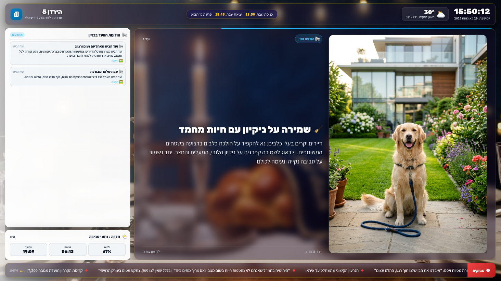 | 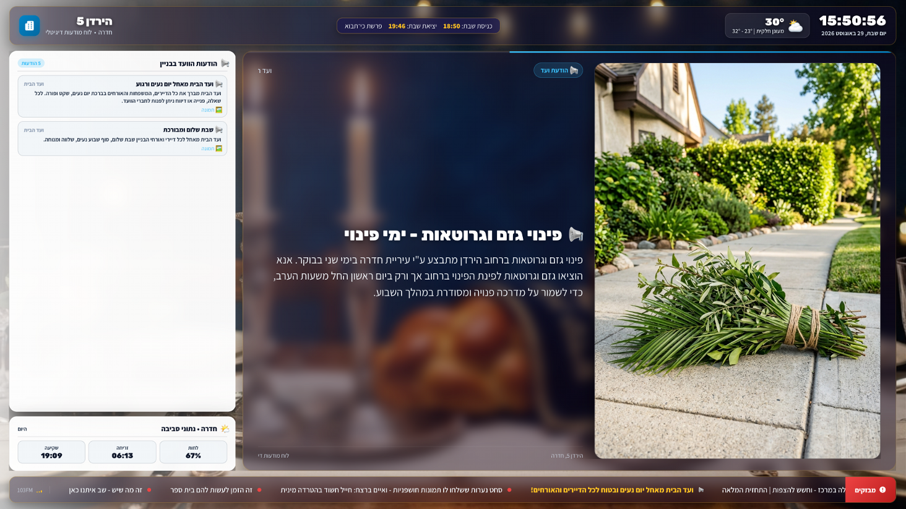 |

| 🧹 הודעת ועד: ניקיון מסדרונות ומעלית | ✨ הודעת ועד: ברכת יום רגוע בלובי |
| :---: | :---: |
| 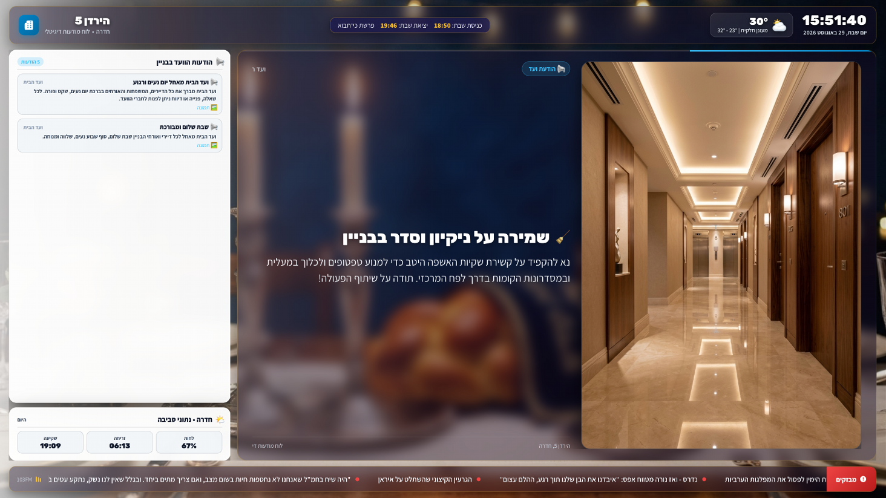 | 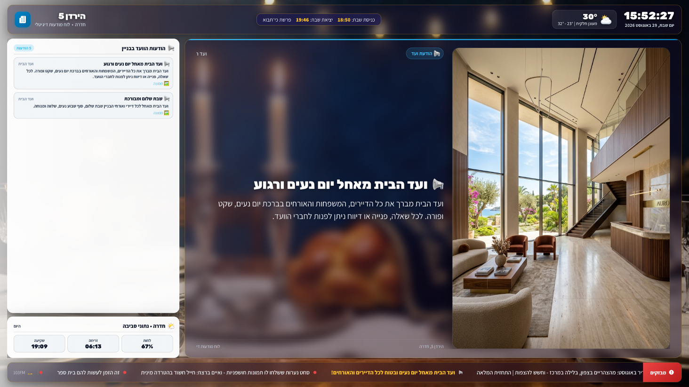 |

| 🕯️ כרטיס Grand Hero: שבת שלום והדלקת נרות | 📞 ספר טלפונים ומספרי חירום לבניין |
| :---: | :---: |
| 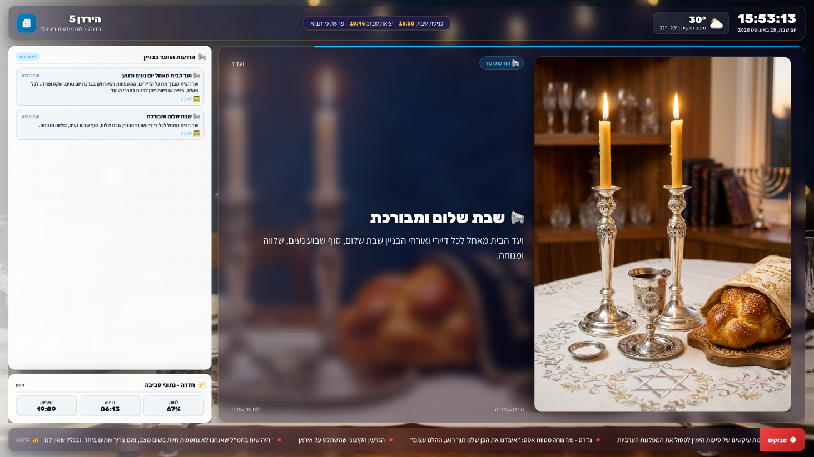 | 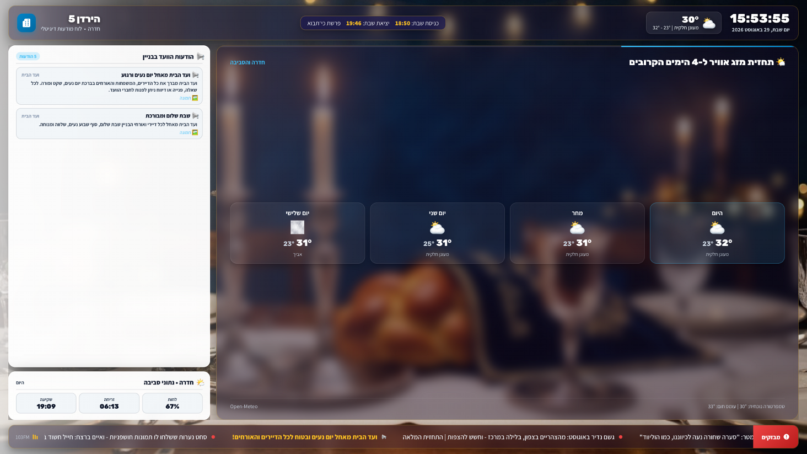 |

---

### 📱 2. פאנל ניהול לוועד הבית (Mobile & Tablet Admin)

| 🔐 1. מסך הזנת קוד PIN מאובטח | 📢 2. לשונית ניהול הודעות ומודעות |
| :---: | :---: |
| 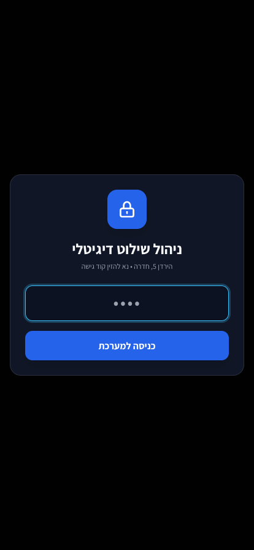 | 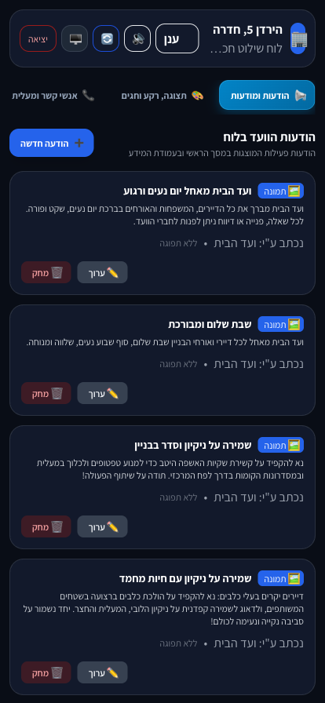 |

| 🎨 3. כיול תצוגה, שקיפות וערכות נושא | 📻 4. נגן מוזיקת רקע ורדיו 103FM |
| :---: | :---: |
| 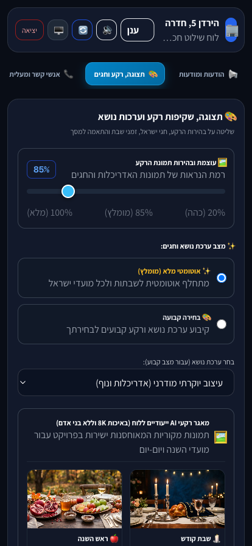 |  |

| 💡 5. מפת מחוות מגע למסך הפיזי | 🖼️ 6. חלון גלריית תמונות מובנית |
| :---: | :---: |
| 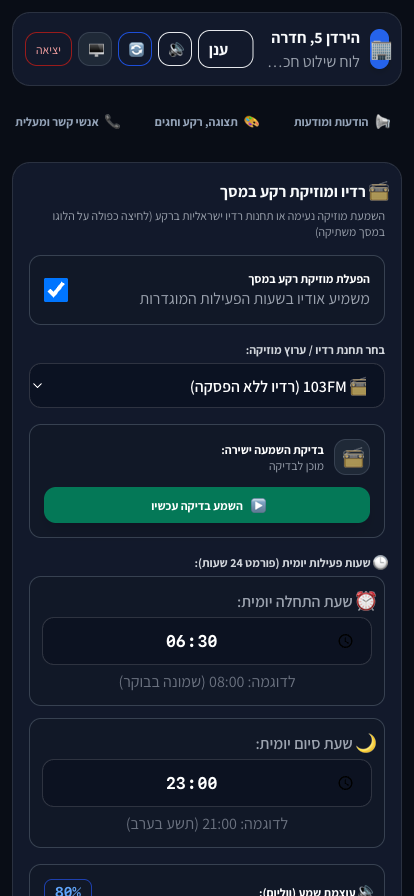 | 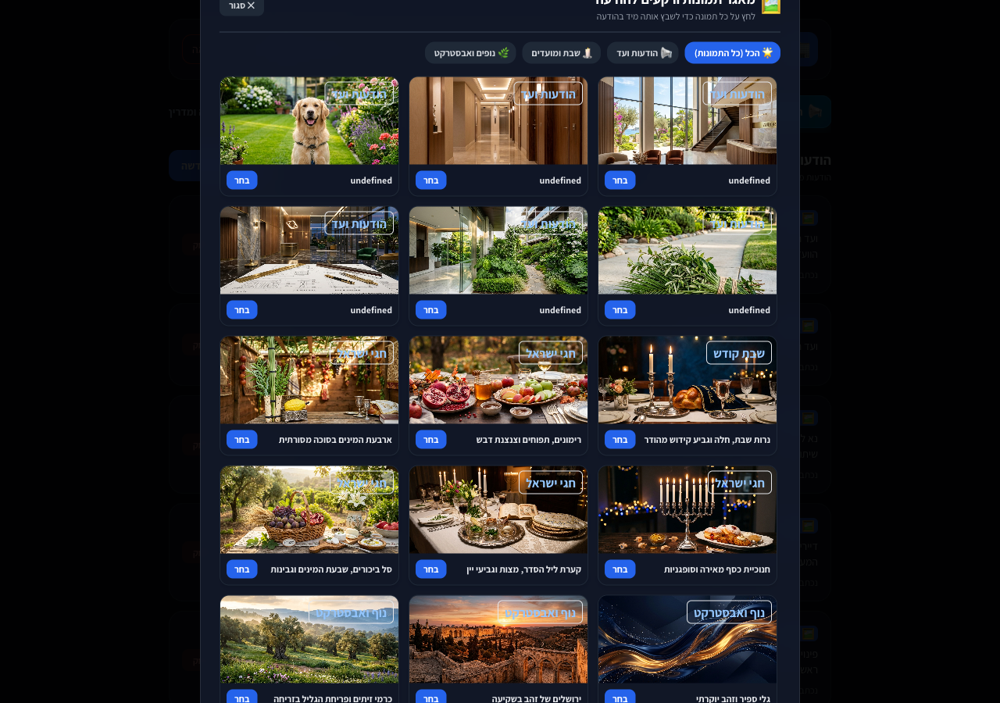 |

---

## 📖 אודות הפרויקט
**Smart Building Digital Signage** היא מערכת שילוט דיגיטלי מתקדמת, קלת משקל ואוטונומית, שתוכננה במיוחד עבור מסכי מגע וטאבלטים בלובי של בנייני מגורים. המערכת מחליפה את דפי ה-A4 וההודעות המודפסות הישנות בלוח מדיה עשיר, אינטראקטיבי וחי, ומציעה פאנל ניהול נגיש מהאייפון/אנדרואיד עבור ועד הבית.

פותח ועוצב ע"י **[עומר ניניו (Omer Ninyo)](https://github.com/omerninyo)**.

---

## ✨ תכונות ויתרונות מרכזיים

### 🔐 1. מערכת הרשאות כפולה (Dual-PIN System)
* **👤 מצב חבר ועד מופשט (PIN: `1111`):**
  * מותאם במיוחד לחברי ועד שאינם אנשי טכנולוגיה.
  * מציג **2 לשוניות בלבד**: 📢 **הודעות ומודעות** ו-📻 **מוזיקה ורדיו**.
  * נועל ומסתיר את כל הגדרות המערכת הרגישות למניעת שינוי תצוגה בשוגג.
* **🔑 מצב מנהל ראשי (PIN: `1234`):**
  * גישה מלאה לכל 6 הלשוניות, כיול תצוגה, שקיפות רקעים, אנשי קשר, וסנכרון ענן.

### ⚡ 2. סנכרון ענן גלובלי בזמן אמת (Google Firebase Firestore)
* **עדכון מיידי בכל המכשירים:** כל שינוי הודעה או הגדרה מהנייד מסתנכרן לענן ומופיע במסך הלובי בתוך פחות משנייה ללא צורך בריענון דף.
* **רענון מרחוק (Force Reload):** לחיצה על כפתור ריענון באדמין מבצעת ריענון מיידי למסך הפיזי בלובי מרחוק.
* **עמידות בניתוקי אינטרנט:** המשך פעולה אוטונומי מלא ממטמון מקומי בעת נפילת רשת רגעית.

### 🕯️ 3. לוח שנה עברי אוטונומי ומועדי ישראל
* **מנוע Hebcal GPS:** חישוב מדויק של זמני כניסת/יציאת שבת ופרשת השבוע לפי מיקום הבניין.
* **ערכות נושא אוטומטיות לחגים:** החלפת רקעים וכרטיסי ברכה לשבת, ראש השנה, יום כיפור, סוכות, חנוכה, ט"ו בשבט, פורים, פסח, יום העצמאות ושבועות.

### 📻 4. נגן מוזיקת רקע ורדיו ישראלי
* תחנות רדיו מובילות: **103FM (רדיו ללא הפסקה), גלגלצ, גלי צה"ל, כאן 88, כאן גימל, קול המוסיקה, Eco 99 FM, רדיוס 100FM, Chillout Lounge**.
* **טיימר שידור יומי:** הגדרת שעות פעילות (למשל `08:00` עד `21:00`).
* **מחוות השתקה סודית:** לחיצה ארוכה על השעון במסך (1.2 שנ') להשתקה/הפעלה מיידית.

### 🛡️ 5. הגנה על המסך ומניעת צריבת תאורה (Anti-Burn-in)
* בקרת שקיפות קריסטלית, הגברת בהירות לאזורים דהויים במסך ישן, ואפשרות להיפוך פריסה (Layout Flip).

---

## 📺 המלצת חומרה ומסכי Kiosk לאנדרואיד (Fully Kiosk Browser)

עבור התקנה קבועה בלובי (טאבלטים או מסכי מגע צמודי קיר), אנו **ממליצים בחום על שימוש באפליקציית [Fully Kiosk Browser](https://www.fully-kiosk.com/)** (נבדקה ואושרה בייצור):
* ⚡ **עבודה חלקה ב-60fps** גם על טאבלטים ישנים עם אנדרואיד 7 ומעלה.
* 🔒 **נעילת Kiosk מלאה** המונעת מעוברי אורח לצאת מהאפליקציה או לפתוח הגדרות.
* 🔌 **הפעלה אוטומטית (Auto-Start)** בהדלקה או לאחר הפסקת חשמל.
* 💡 **שמירה על מסך דולק 24/7** או ניהול שעות כיבוי/הדלקה.

---

## 🌍 איך להקים מסך כזה לבניין שלכם ב-3 דקות (מדריך שימוש בתבנית)

כל אחד מוזמן להשתמש בפרויקט ולהרים מסך שילוט חכם לבניין שלו:

1. **לחצו על כפתור `Use this template`** בראש המאגר ב-GitHub.
2. **התאימו את פרטי הבניין** בקובץ `data/settings.json` (שם הבניין, עיר וקואורדינטות GPS לזמני שבת מדויקים).
3. **הפעילו את GitHub Pages:**
   * היכנסו ל-**Settings ➡️ Pages** במאגר שלכם.
   * בחרו ב-**Deploy from a branch (main)**.
   * **זה הכל! לוח השילוט של הבניין שלכם באוויר ופעיל מיד!**

---

## 📜 רישיון וקרדיט

כל הזכויות שמורות (c) 2026 **עומר ניניו (Omer Ninyo)**.  
פרויקט זה מופץ תחת תנאי רישיון **MIT עם ייחוס חובה (Attribution)**. כולם מוזמנים לעיין, להשתמש, לשכפל ולהתאים את הפרויקט לבניין שלהם, ובלבד שנשמר קרדיט מפורש ליוצר הפרויקט **Omer Ninyo**.
