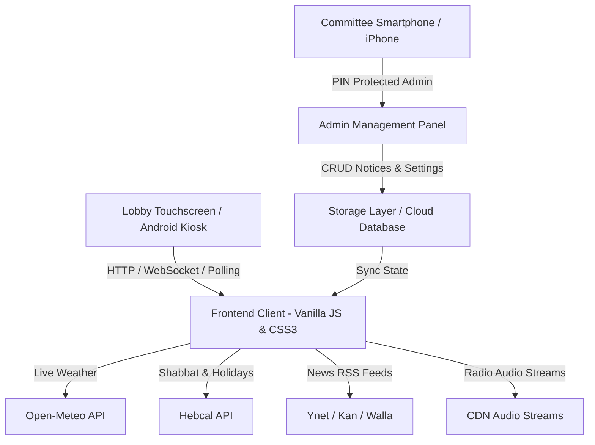

# 🏢 Smart Building Digital Signage (לוח שילוט דיגיטלי חכם לבניין)
> A modern, autonomous, touchscreen-enabled Digital Signage Kiosk & Committee Management System for residential buildings.

[](LICENSE)
[]()
[](https://omerninyo.github.io/smart-lobby/)
[](https://github.com/omerninyo)
[]()

---

## 🌐 Live Kiosk & Demo Links
* 🖥️ **Live Lobby Kiosk Display:** [https://omerninyo.github.io/smart-lobby/](https://omerninyo.github.io/smart-lobby/)
* 📱 **Mobile / iPhone Admin Panel:** [https://omerninyo.github.io/smart-lobby/admin.html](https://omerninyo.github.io/smart-lobby/admin.html) (Default PIN: `1234`)

---

## 📖 Overview
**Smart Building Digital Signage** is a lightweight, zero-bloat digital signage dashboard engineered specifically for residential lobby touchscreens (such as wall-mounted Android tablets or commercial smart screens). It replaces antiquated static slides with an interactive, rich, autonomous media board and an iPhone/Mobile-friendly administration panel for building committees (ועד בית).

Designed and developed by **[Omer Ninyo](https://github.com/omerninyo)**.

---

## ✨ Key Features & Capabilities

### 📢 1. Interactive Notice Board (לוח הודעות ועד)
* **Urgent & Standard Notices:** Automatic priority styling (urgent alerts highlighted in red).
* **Flyer & Image Attachments:** Split-screen layout (50% image flyer + 50% typography text) for maximum readability.
* **Auto-Expiration:** Notices can be scheduled to disappear automatically after a set date.
* **Touch-to-Jump:** Tapping any notice in the side column instantly focuses it on the main stage.

### 🕯️ 2. Autonomous Jewish Calendar & Israeli Special Events (שבת, מועדים ותאריכים מיוחדים)
* **Hebcal Integration:** Auto-calculates candle lighting, Havdalah times, and weekly Torah portion (Parashat HaShavua) dynamically based on local GPS coordinates.
* **Complete Holiday & Event Roster:** Full automated theme and photo collections for *שבת, ראש השנה, יום כיפור, סוכות ושמחת תורה, חנוכה, ט"ו בשבט, פורים, פסח, יום הזיכרון לשואה ולגבורה, יום הזיכרון לחללי צה"ל, יום העצמאות, ל"ג בעומר, יום ירושלים, שבועות, ט"ו באב*.
* **Israeli National & Civil Dates:** Auto-activates for **1 בספטמבר (שלום כיתה א' ופתיחת שנת הלימודים)**, **שנה אזרחית חדשה (31.12 - 1.1)**, **יום המשפחה** ו**ימי בחירות**.
* **HD Photographic Collections:** Verified, authentic high-resolution photographic wallpapers matching each specific holiday/event.

### 🎨 3. Background Opacity & Dimming Controls
* **Real-time Opacity Slider (0–100%):** Fine-tune background wallpaper visibility directly from the admin panel.
* **Auto-Dimming Contrast Layer:** Dynamically balances brightness to guarantee 100% text readability over complex photos.

### 🌦️ 4. Live Weather & Environmental Metrics (מזג אוויר וסביבה)
* **Real-time API:** Fetches live temperature, weather conditions, relative humidity, and sunrise/sunset times.
* **4-Day Forecast:** Interactive touch modal and scheduled slide displaying full multi-day forecasts.

### 📰 5. Live Breaking News Ticker (פס מבזקי חדשות רץ)
* Multi-source RSS feed streaming live news headlines from **Ynet**, **Kan News**, or **Walla!**.
* Integrated custom ticker announcement from the building committee.
* Speed control (*Slow, Normal, Fast*) for comfortable reading from a distance.

### 📻 6. Background Radio & Lounge Audio (רדיו ומוזיקת רקע)
* Live internet radio streaming (Galgalatz, GLZ, Chillout Lounge, Dance).
* Daily broadcast schedule timer (e.g. 08:00–21:00) with volume control.
* **Secret Mute Gesture:** Double-tapping the building logo on the touchscreen secretly mutes or unmutes the audio stream.

### 💡 7. Hardware Backlight Burn Compensation (פיצוי תאורה לצד שמאל)
* Specially engineered for older LCD panels suffering from degraded or burnt-out left-edge backlight LEDs:
  * **Luminance Boost Slider (0–100%):** Smooth mathematical gradient overlay that lifts gamma and luminance across the dim panel.
  * **High-Contrast Pearl Cards:** Forces maximum LCD crystal transmittance to emit the highest possible lux from weak LEDs.
  * **Layout Flipping:** One-click toggle to swap the side info column between left and right.

### 📱 8. Mobile & iPhone Optimized Admin Panel + Touch Cheat Sheet
* **Reorganized 6-Tab Interface:** Notice Board, Display & Holidays, Contacts & Elevator, Music & Radio, Security & Settings, and Help.
* **Interactive Touch Cheat Sheet (מפת אזורי מגע):** Comprehensive guide to all on-screen gestures (5-tap admin PIN popup on clock, double-tap secret mute, slide swipe gestures, modal expansions).
* Protected with an on-screen PIN code.
* 100% native HTML5 file picker support for iOS Safari (Photo Library / Camera) and Android browsers.

---

## 🏗️ Architecture & Technology Stack



* **Frontend:** Vanilla JavaScript (ES6+), GPU-accelerated CSS transforms (`translate3d`), Fluid Typography (`clamp()`), Tailwind CSS.
* **Backend / Host:** Node.js Express / GitHub Pages Static Hosting with Firebase Cloud.
* **Zero External Dependencies:** Built specifically to guarantee 60fps smoothness even on low-spec Android 7 hardware.

---

## 🚀 Deployment Pathways & Hosting Options

Smart Lobby is engineered to run seamlessly across three different hosting architectures, depending on your building's budget and complexity:

### 1️⃣ Option A: GitHub Pages (Zero Server • 100% Free • Recommended for Portfolios)
* **How it works:** Pure client-side static hosting powered by GitHub's global CDN and automated via `.github/workflows/deploy.yml`.
* **API Handling:** Fetches live weather directly from Open-Meteo, Jewish calendar from Hebcal, and news feeds via CORS-friendly RSS.
* **Setup:**
  1. In your GitHub repo: Go to **Settings** → **Pages**.
  2. Under **Build and deployment** → **Source**, select **GitHub Actions**.
  3. The workflow builds and deploys `public/` automatically!

### 2️⃣ Option B: Cloudflare Pages & Workers (Edge Serverless • Sub-10ms Tel Aviv Latency)
* **How it works:** Ultra-fast static assets deployed to Cloudflare's Edge Network (with local servers in Tel Aviv, Israel).
* **Serverless Backend:** Optional Cloudflare Worker with **Cloudflare KV** or **D1 SQL Database** for CRUD operations and photo uploads without paying for a traditional virtual server.
* **Setup:**
  1. Connect your repository to **Cloudflare Pages** via the Cloudflare Dashboard.
  2. Set build directory to `public`.

### 3️⃣ Option C: Self-Hosted Node.js / Docker (Local Raspberry Pi, Mini PC or VPS)
* **How it works:** Full standalone Node.js Express server with local JSON file storage (`data/`) and local image uploads (`public/uploads/`).
* **Run:**
  ```bash
  npm install
  npm start
  ```

---

## 🌐 Custom Domain & DNS Configuration

You can easily bind your own custom domain (e.g. `lobby.yourdomain.com` or `hayarden5.co.il`):

### In GitHub Pages:
1. Navigate to **Settings** → **Pages** → **Custom domain**.
2. Enter your domain (e.g. `lobby.yourdomain.co.il`) and click **Save**.

### In your DNS Provider:

#### 🔹 Option 1: Hover / Direct Registrar
* Add a `CNAME` record:
  * **Type:** `CNAME`
  * **Hostname:** `lobby` (or subdomain)
  * **Target:** `omerninyo.github.io`

#### 🔹 Option 2: Cloudflare (Recommended for Tel Aviv Edge Caching)
* Add a `CNAME` record:
  * **Name:** `lobby` (or `@` for root domain with CNAME Flattening)
  * **Target:** `omerninyo.github.io`
  * **Proxy status:** `Proxied (Orange Cloud ☁️)`
* ⚠️ **Important SSL Setting in Cloudflare:** Set **SSL/TLS Encryption Mode** to **Full** or **Full (strict)** to prevent infinite redirect loops.

---

## 📺 Kiosk Setup Guide for Lobby Screen (Android)
For permanent wall-mounted installations:
1. Install **Fully Kiosk Browser** on your Android tablet or TV screen.
2. Set **Start URL** to your deployment address.
3. Enable **Kiosk Mode (Locked)**, **Start on Boot**, and **Keep Screen On**.

---

## 📜 License & Attribution

Copyright (c) 2026 **Omer Ninyo**.  
This project is licensed under the terms of the MIT License with mandatory attribution. Anyone is welcome to inspect, fork, and adapt this project for their own building, provided that **explicit credit to Omer Ninyo** is retained.
