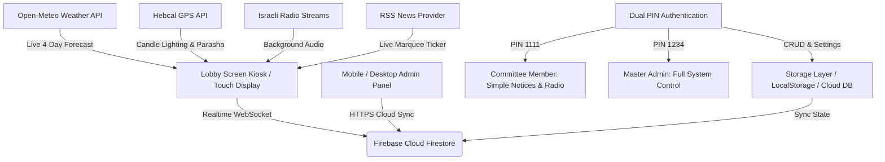

<p align="center">
  <b><a href="README.md">🇬🇧 English</a></b> | 
  <b><a href="README.he.md">🇮🇱 עברית (Hebrew)</a></b>
</p>

# 🏢 Smart Building Digital Signage (לוח שילוט דיגיטלי חכם לבניין)
> A modern, autonomous, touchscreen-enabled Digital Signage Kiosk & Committee Management System for residential buildings.

[](LICENSE)
[]()
[](https://omerninyo.github.io/smart-lobby)
[](https://github.com/omerninyo)
[]()

---

## 🌐 Quick Access & Deployment
* 🖥️ **Lobby Kiosk Display:** `https://<your-domain>/` (or your GitHub Pages root)
* 📱 **Mobile & Desktop Admin Panel:** `https://<your-domain>/admin.html`
  * 🔑 **Default Master Admin PIN:** `1234` *(Customizable in settings)*
  * 👤 **Default Committee Member PIN:** `1111` *(Customizable in settings)*

---

## 📸 Comprehensive Visual Showcase

### 🖥️ 1. Main Lobby Touchscreen Kiosk Display (1080p Interactive Stage)

| 🐕 Notice: Pets & Lawn Care (Vertical 3:4 Layout) | 🌿 Notice: Pruning & Waste Schedule |
| :---: | :---: |
|  |  |

| 🧹 Notice: Corridor & Elevator Care | ✨ Notice: Daily Welcome & Building Greeting |
| :---: | :---: |
|  |  |

| 🕯️ Grand Hero Slide: Shabbat & Candle Lighting | 📞 Building Service & Emergency Contacts Directory |
| :---: | :---: |
|  |  |

---

### 📱 2. Mobile & Tablet Committee Administration Panel (iOS / Android)

| 🔐 1. Dual-PIN Access Keypad | 📢 2. Notice Management Tab |
| :---: | :---: |
|  |  |

| 🎨 3. Display & Opacity Calibration | 📻 4. Background Radio & 103FM Player |
| :---: | :---: |
|  |  |

| 💡 5. Touch Gestures & Hardware Map | 🖼️ 6. Curated AI Image Gallery Picker |
| :---: | :---: |
|  |  |

---

## 📖 Overview
**Smart Building Digital Signage** is a lightweight, zero-bloat digital signage dashboard engineered specifically for residential lobby touchscreens (such as wall-mounted Android tablets or commercial smart screens). It replaces antiquated static slides with an interactive, rich, autonomous media board and an iPhone/Mobile-friendly administration panel for building committees (ועד בית).

Designed and developed by **[Omer Ninyo](https://github.com/omerninyo)**.

---

## ✨ Key Features & Capabilities

### 🔐 1. Role-Based Dual PIN System (מערכת הרשאות כפולה)
* **👤 Simplified Committee Member Mode (PIN: `1111`):**
  * Specially designed for non-technical or senior committee members.
  * Displays **ONLY 2 Tabs**: 📢 **הודעות ומודעות** (Notice Board) and 📻 **מוזיקה ורדיו** (Radio Controls).
  * Automatically **hides and locks** all complex system settings (Display, Opacity, Backlight Burn, Emergency Contacts, Security, Touch Guide) to prevent accidental alterations.
* **🔑 Master Admin Mode (PIN: `1234`):**
  * Full access to all 6 tabs, hardware calibration, background opacity sliders, theme management, and security PIN updates.

### 🖼️ 2. Dynamic Image & Wallpaper Gallery Picker (גלריית תמונות אינטראקטיבית)
* **Modal Picker in Notice Form:** Directly browse and pick ANY image from the system's curated asset library with 1 click.
* **Categorized Collections:**
  * 📢 **הודעות ועד:** Maintenance & Renovations, Cleaning & Gardening, Pet Care, Hallway Maintenance.
  * 🕯️ **שבת ומועדים:** Shabbat, Rosh Hashanah, Sukkot, Hanukkah, Pesach, Shavuot.
  * 🌿 **נופי ישראל ואבסטרקט:** Jerusalem Sunset, Galilee Olive Groves, Fluid Gold Luxury.
* **Custom Mobile Uploads:** Upload flyers/photos directly from iPhone or Android camera/gallery.

### 📢 3. Interactive Notice Board & Permanent Deletion (לוח הודעות ועד)
* **Urgent & Standard Notices:** Automatic priority styling (urgent alerts highlighted with glowing red badges).
* **Vertical Split-Screen Layout (3:4):** 46% vertical photographic visual + 54% typography text for optimal viewing distance.
* **Permanent Local Deletion:** Deleted notices are tracked persistently across reloads.
* **Auto-Expiration:** Notices can be scheduled to automatically expire and disappear on a specific date.

### 📻 4. Background Radio & Israeli Audio Suite (רדיו ומוזיקת רקע)
* **Top Israeli Radio Stations:**
  * 📻 **103FM (רדיו ללא הפסקה)**
  * 📻 **גלגלצ (Galgalatz)**
  * 📻 **גלי צה"ל (GLZ)**
  * 🎵 **כאן 88 (Kan 88)**
  * 🇮🇱 **כאן גימל (Kan Gimmel)**
  * 🎻 **קול המוסיקה (Kol HaMusica)**
  * 🌿 **Eco 99 FM**
  * 📻 **רדיוס 100FM**
  * ☕ **Chillout & Lofi Lounge (24/7)**
  * 🕺 **I Love Dance & Hits**
* **Admin Live Test Player:** Listen and verify radio streams directly inside the admin panel before deploying to the lobby.
* **Daily Auto-Play Scheduler:** Define daily broadcast hours (e.g. `08:00`–`21:00`).
* **Secret Mute Gesture:** Long-press the clock (1.2s) or double-tap the logo to instantly mute/unmute audio.

### ⚡ 5. Real-Time Global Cloud Sync (Google Firebase Firestore)
* **Instant Multi-Device Sync:** Any notice or setting updated from an iPhone/Android or laptop is synced instantly via Firebase Firestore (`onSnapshot`) and pushed to the lobby screen in real-time without page reloads.
* **Offline Resilience:** Seamless fallback to LocalStorage and local JSON files if internet connection drops temporarily.
* **Fork-Safe & Domain Protected:** Secured via Google Cloud authorized domain filters.

### 🕯️ 6. Autonomous Jewish Calendar & Israeli Special Events (שבת ומועדי ישראל)
* **Dynamic Hebcal GPS Engine:** Automatic calculation of candle lighting, Havdalah times, and Parashat HaShavua for your building's location.
* **Automated Festive Themes:** Auto-activates matching photographic wallpapers for Shabbat, Rosh Hashanah, Yom Kippur, Sukkot, Hanukkah, Tu BiShvat, Purim, Pesach, Memorial Days, Independence Day, Shavuot, and Tu B'Av.
* **National Dates:** Special themes for 1st of September (שלום כיתה א'), New Year's, Family Day, and Elections.

---

## 🏗️ Architecture & Technology Stack



* **Frontend:** Vanilla JavaScript (ES6+), GPU-accelerated CSS transforms (`translate3d`), Fluid Typography (`clamp()`), Tailwind CSS.
* **Hosting:** GitHub Pages with automated Actions CI/CD.
* **Zero External Dependencies:** Built specifically to guarantee 60fps smoothness even on legacy Android 7 hardware.

---

## 📱 Admin Panel Tabs & Access Levels

| לשונית | תיאור | גישת מנהל ראשי (`1234`) | גישת חבר ועד (`1111`) |
| :--- | :--- | :---: | :---: |
| 📢 **הודעות ומודעות** | יצירה, עריכה, מחיקה ובחירת תמונות מהגלריה | ✅ | ✅ |
| 📻 **מוזיקה ורדיו** | הפעלה/השתקה, בחירת תחנה, ווליום ובדיקת סאונד | ✅ | ✅ |
| 🎨 **תצוגה, רקע וחגים** | שקיפות רקעים, ערכות נושא, פיצוי צריבה, חגים | ✅ | ❌ *(מוסתר)* |
| 📞 **אנשי קשר וחירום** | מספרי טלפון למעלית, מוקד עירייה וחירום | ✅ | ❌ *(מוסתר)* |
| ⚙️ **הגדרות ואבטחה** | פרטי בניין, מקור חדשות, שינוי קודי PIN | ✅ | ❌ *(מוסתר)* |
| 💡 **עזרה ומפת מגע** | מדריך מחוות מגע במסך ונקודות אינטראקציה | ✅ | ❌ *(מוסתר)* |

---

## 🚀 Deployment Pathways & Hosting Options

### 1️⃣ Option A: GitHub Pages (Recommended)
* **Zero Cost & Instant Setup:** Powered by GitHub Actions.
* **API Handling:** Fetches live weather directly from Open-Meteo, Jewish calendar from Hebcal, and news feeds via RSS.

### 2️⃣ Option B: Self-Hosted Node.js / Docker
* Standalone Node.js Express server (`server.js`) with local JSON storage (`data/`) and image uploads (`public/uploads/`).
* Run locally:
  ```bash
  npm install
  npm start
  ```

---

## 📺 Recommended Hardware & Android Kiosk Setup Guide

For permanent residential lobby installations (wall-mounted Android tablets, smart TVs, or commercial signage touchscreens running 24/7), we recommend two excellent kiosk applications:

### 🥇 1. [Webview Kiosk](https://webviewkiosk.nktnet.uk) (Top Recommended - 100% Free & Open Source)
* 🆓 **100% Free & Open Source (FOSS):** No licensing fees, no watermarks, no paywalls.
* 📱 **Ultra-Lightweight & Legacy-Friendly:** Runs exceptionally smoothly on older Android tablets with minimal RAM and CPU overhead.
* 🔒 **Lock Task Mode (Screen Pinning):** Locks the display strictly to the lobby web app, hides system bars, and prevents exiting.
* 🛡️ **Password & Biometric Protected Settings:** Prevents unauthorized tampering with kiosk configuration.
* 📦 **Easy Installation:** Available on [Google Play](https://play.google.com/store/apps/details?id=uk.nktnet.webviewkiosk), [F-Droid](https://f-droid.org/), and direct APK releases on [GitHub](https://github.com/nktnet1/webview-kiosk).

---

### 🥈 2. [Fully Kiosk Browser](https://www.fully-kiosk.com/) (Advanced Commercial Option)
* ⚡ **Legacy Hardware Compatibility:** Seamless 60fps hardware-accelerated rendering.
* 🔒 **Locked Kiosk Mode:** Full kiosk lockdown and navigation bar concealment.
* 🔌 **Auto-Start & Power-Loss Recovery:** Automatically launches the lobby dashboard immediately upon device boot.
* 💡 **Motion Detection via Front Camera:** Automatically wakes the display when residents approach.

### ⚙️ Recommended Fully Kiosk Browser Configuration:
1. **Web Browsing Settings:**
   * **Start URL:** `https://<your-building-domain>/` (or your building's GitHub Pages domain).
   * **Enable WebGL / Hardware Acceleration:** `ON`
   * **Clear Cache on Start:** `OFF` (preserves instant offline loading).
2. **Device Management Settings:**
   * **Keep Screen On:** `ON` (when connected to AC power).
   * **Run as Launcher / Kiosk Mode:** `ON` (locks device to signage).
3. **Audio & Media Settings:**
   * **Autoplay Audio:** `Enabled` (for smooth background radio playback).

---

## 🌍 How to Deploy for Your Own Building (Open Source Guide)
Anyone is welcome to fork this repository and launch a smart lobby board for their own residential building in 3 minutes:

1. **Fork this repository** to your own GitHub account.
2. **Customize your building settings** in `data/settings.json` (Building name, city, and GPS coordinates for accurate Shabbat and weather times).
3. **Enable GitHub Pages:**
   * Go to **Settings** ➡️ **Pages** in your repository.
   * Under **Build and deployment**, select **Deploy from a branch** ➡️ choose `main` / `root` (or GitHub Actions).
   * Your building dashboard is immediately live!
4. *(Optional)* **Enable Real-Time Cloud Sync:**
   * Create a free project at [Firebase Console](https://console.firebase.google.com).
   * Copy `js/config.example.js` to `js/config.js` and paste your project credentials.

---

## 📜 License & Attribution

Copyright (c) 2026 **Omer Ninyo**.  
This project is licensed under the terms of the MIT License with mandatory attribution. Anyone is welcome to inspect, fork, and adapt this project for their own building, provided that **explicit credit to Omer Ninyo** is retained.
