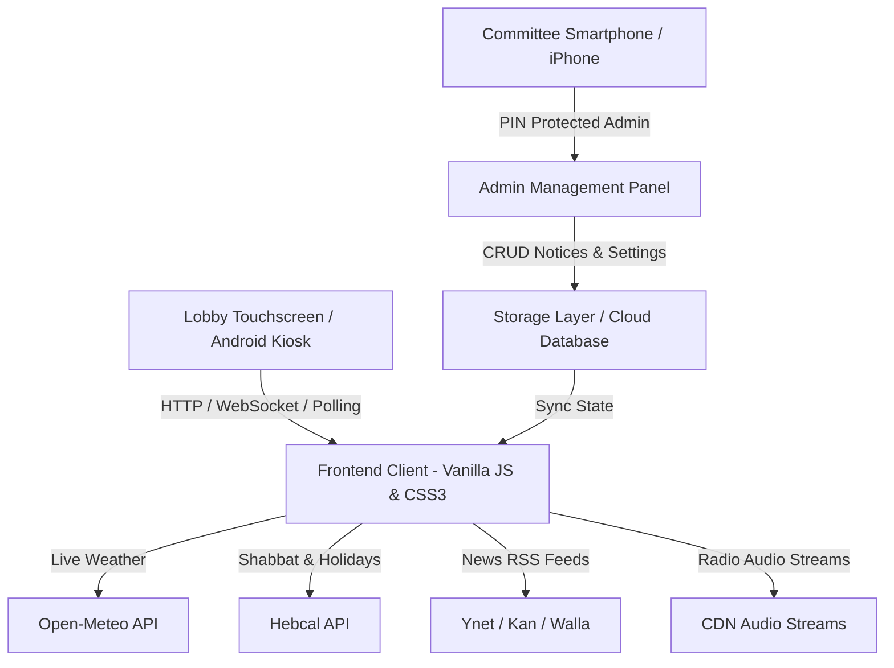

# 🏢 Smart Building Digital Signage (לוח שילוט דיגיטלי חכם לבניין)
> A modern, autonomous, touchscreen-enabled Digital Signage Kiosk & Committee Management System for residential buildings.

[](LICENSE)
[]()
[](https://github.com/omerninyo)
[]()

---

## 📖 Overview
**Smart Building Digital Signage** is a lightweight, zero-bloat digital signage dashboard engineered specifically for residential lobby touchscreens (such as wall-mounted Android tablets or commercial smart screens). It replaces antiquated static slides with an interactive, rich, autonomous media board and an iPhone/Mobile-friendly administration panel for building committees (ועד בית).

Designed and developed by **[Omer Ninyo](https://github.com/omerninyo)**.

---

## ✨ Key Features & Capabilities

### 📢 1. Interactive Notice Board (לוח הודעות ועד)
* **Urgent & Standard Notices:** Automatic priority styling (urgent alerts highlighted in red).
* **Flyer & Image Attachments:** Split-screen layout (50% image flyer + 50% typography text) for maximum readability.
* **Auto-Expiration:** Notices can be scheduled to disappear automatically after a set date.
* **Touch-to-Jump:** Tapping any notice in the side column instantly focuses it on the main stage.

### 🕯️ 2. Autonomous Jewish Calendar & Shabbat Times (שבת וחגי ישראל)
* **Hebcal Integration:** Auto-calculates candle lighting, Havdalah times, and weekly Torah portion (Parashat HaShavua) based on local coordinates.
* **HD Holiday Themes & Photography:** Automatically transitions the kiosk theme and displays authentic high-resolution wallpapers for *Shabbat, Rosh Hashanah, Sukkot, Hanukkah, Purim, Pesach, Yom Ha'Atzmaut, and Shavuot*.

### 🌦️ 3. Live Weather & Environmental Metrics (מזג אוויר וסביבה)
* **Real-time API:** Fetches live temperature, weather conditions, relative humidity, and sunrise/sunset times.
* **4-Day Forecast:** Interactive touch modal and scheduled slide displaying full multi-day forecasts.

### 📰 4. Live Breaking News Ticker (פס מבזקי חדשות רץ)
* Multi-source RSS feed streaming live news headlines from **Ynet**, **Kan News**, or **Walla!**.
* Integrated custom ticker announcement from the building committee.
* Speed control (*Slow, Normal, Fast*) for comfortable reading from a distance.

### 📻 5. Background Radio & Lounge Audio (רדיו ומוזיקת רקע)
* Live internet radio streaming (Galgalatz, GLZ, Chillout Lounge, Dance).
* Daily broadcast schedule timer (e.g. 08:00–21:00) with volume control.
* **Secret Mute Gesture:** Double-tapping the building logo on the touchscreen secretly mutes or unmutes the audio stream.

### 💡 6. Hardware Backlight Burn Compensation (פיצוי תאורה לצד שמאל)
* Specially engineered for older LCD panels suffering from degraded or burnt-out left-edge backlight LEDs:
  * **Luminance Boost Slider (0–100%):** Smooth mathematical gradient overlay that lifts gamma and luminance across the dim panel.
  * **High-Contrast Pearl Cards:** Forces maximum LCD crystal transmittance to emit the highest possible lux from weak LEDs.
  * **Layout Flipping:** One-click toggle to swap the side info column between left and right.

### 📱 7. Mobile & iPhone Optimized Admin Panel
* Protected with an on-screen PIN code.
* 100% native HTML5 file picker support for iOS Safari (Photo Library / Camera) and Android browsers.
* Real-time settings customization (resolution presets: Auto, 1080p, 720p).

---

## 🏗️ Architecture & Technology Stack



* **Frontend:** Vanilla JavaScript (ES6+), GPU-accelerated CSS transforms (`translate3d`), Fluid Typography (`clamp()`), Tailwind CSS.
* **Backend / Host:** Node.js Express / GitHub Pages Static Hosting with Firebase Cloud.
* **Zero External Dependencies:** Built specifically to guarantee 60fps smoothness even on low-spec Android 7 hardware.

---

## 🚀 Quickstart & Local Deployment

### 1. Clone the repository
```bash
git clone https://github.com/omerninyo/smart-lobby.git
cd smart-lobby
```

### 2. Install dependencies & Run
```bash
npm install
npm start
```

### 3. Access URLs
* **Kiosk Main Display:** `http://localhost:3000/`
* **Admin Management Panel:** `http://localhost:3000/admin` (Default PIN: `1234`)

---

## 📺 Kiosk Setup Guide for Lobby Screen (Android)
For permanent wall-mounted installations:
1. Install **Fully Kiosk Browser** on your Android tablet or TV screen.
2. Set **Start URL** to your deployment address.
3. Enable **Kiosk Mode (Locked)**, **Start on Boot**, and **Keep Screen On**.

---

## 📜 License & Attribution

Copyright (c) 2026 **Omer Ninyo**.  
This project is licensed under the terms of the MIT License with mandatory attribution. Anyone is welcome to inspect, fork, and adapt this project for their own building, provided that **explicit credit to Omer Ninyo** is retained.
