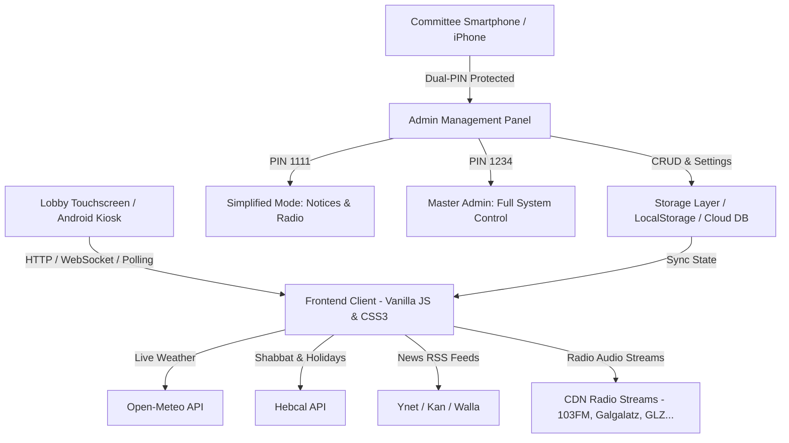

# 🏢 Smart Building Digital Signage (לוח שילוט דיגיטלי חכם לבניין)
> A modern, autonomous, touchscreen-enabled Digital Signage Kiosk & Committee Management System for residential buildings.

[](LICENSE)
[]()
[](https://lobby.ninyo.co)
[](https://github.com/omerninyo)
[]()

---

## 🌐 Live Production Links
* 🖥️ **Live Lobby Kiosk Display:** [https://lobby.ninyo.co](https://lobby.ninyo.co)
* 📱 **Mobile & Desktop Admin Panel:** [https://lobby.ninyo.co/admin.html](https://lobby.ninyo.co/admin.html)
  * 🔑 **Master Admin PIN:** `1234` (Full access to all 6 tabs & system settings)
  * 👤 **Committee Member PIN:** `1111` (Simplified view: Notices & Radio only)

---

## 📖 Overview
**Smart Building Digital Signage** is a lightweight, zero-bloat digital signage dashboard engineered specifically for residential lobby touchscreens (such as wall-mounted Android tablets or commercial smart screens). It replaces antiquated static slides with an interactive, rich, autonomous media board and an iPhone/Mobile-friendly administration panel for building committees (ועד בית).

Designed and developed by **[Omer Ninyo](https://github.com/omerninyo)**.

---

## ✨ Key Features & Capabilities

### 🔐 1. Role-Based Dual PIN System (מערכת הרשאות כפולה)
* **👤 Simplified Committee Member Mode (PIN: `1111`):**
  * Specially designed for non-technical or senior committee members.
  * Displays **ONLY 2 Tabs**: 📢 **הודעות ומודעות** (Notice Board) and 📻 **מוזיקה ורדיו** (Radio Controls).
  * Automatically **hides and locks** all complex system settings (Display, Opacity, Backlight Burn, Emergency Contacts, Security, Touch Guide) to prevent accidental alterations.
* **🔑 Master Admin Mode (PIN: `1234`):**
  * Full access to all 6 tabs, hardware calibration, background opacity sliders, theme management, and security PIN updates.

### 🖼️ 2. Dynamic Image & Wallpaper Gallery Picker (גלריית תמונות אינטראקטיבית)
* **Modal Picker in Notice Form:** Directly browse and pick ANY image from the system's curated asset library with 1 click.
* **Categorized Collections:**
  * 📢 **הודעות ועד:** Maintenance & Renovations (תחזוקה ושיפוץ), Cleaning & Gardening (ניקיון וגינון).
  * 🕯️ **שבת ומועדים:** Shabbat, Rosh Hashanah, Sukkot, Hanukkah, Pesach, Shavuot.
  * 🌿 **נופי ישראל ואבסטרקט:** Jerusalem Sunset, Galilee Olive Groves, Fluid Gold Luxury.
* **Custom Mobile Uploads:** Upload flyers/photos directly from iPhone or Android camera/gallery.

### 📢 3. Interactive Notice Board & Permanent Deletion (לוח הודעות ועד)
* **Urgent & Standard Notices:** Automatic priority styling (urgent alerts highlighted with glowing red badges).
* **Split-Screen & Image-Rich Layout:** 50% image flyer + 50% typography text for optimal viewing distance.
* **Permanent Local Deletion:** Deleted notices are tracked persistently across reloads via `smart_lobby_deleted_notices`.
* **Auto-Expiration:** Notices can be scheduled to automatically expire and disappear on a specific date.

### 📻 4. Background Radio & 103FM Streaming Suite (רדיו ומוזיקת רקע)
* **Top Israeli Radio Stations:**
  * 📻 **103FM (רדיו ללא הפסקה)**
  * 📻 **גלגלצ (Galgalatz)**
  * 📻 **גלי צה"ל (GLZ)**
  * 🎵 **כאן 88 (Kan 88)**
  * 🇮🇱 **כאן גימל (Kan Gimmel)**
  * 🎻 **קול המוסיקה (Kol HaMusica)**
  * 🌿 **Eco 99 FM**
  * 📻 **רדיוס 100FM**
  * ☕ **Chillout & Lofi Lounge (24/7)**
  * 🕺 **I Love Dance & Hits**
* **Admin Live Test Player:** Listen and verify radio streams directly inside the admin panel before deploying to the lobby.
* **Daily Auto-Play Scheduler:** Define daily broadcast hours (e.g. `08:00`–`21:00`).
* **Secret Mute Gesture:** Long-press the clock (1.2s) or double-tap the logo to instantly mute/unmute audio.

### ⚡ 6. Real-Time Global Cloud Sync (Google Firebase Firestore)
* **Instant Multi-Device Sync:** Any notice or setting updated from an iPhone/Android or laptop is synced instantly via Firebase Firestore () and pushed to the lobby screen in real-time without page reloads.
* **Offline Resilience:** Seamless fallback to LocalStorage and local JSON files if internet connection drops temporarily.
* **Fork-Safe & Domain Protected:** Secured via Google Cloud authorized domain filters.

### 🕯️ 5. Autonomous Jewish Calendar & Israeli Special Events (שבת ומועדי ישראל)
* **Dynamic Hebcal GPS Engine:** Automatic calculation of candle lighting, Havdalah times, and Parashat HaShavua for Hadera (`32.434°N, 34.9197°E`).
* **Automated Festive Themes:** Auto-activates matching photographic wallpapers for Shabbat, Rosh Hashanah, Yom Kippur, Sukkot, Hanukkah, Tu BiShvat, Purim, Pesach, Memorial Days, Independence Day, Shavuot, and Tu B'Av.
* **National Dates:** Special themes for 1st of September (שלום כיתה א'), New Year's, Family Day, and Elections.

### 🎨 6. Crystal Glassmorphism & Screen Calibration
* **Crystal Glassmorphism:** Ultra-sharp 12px blur with dynamic card opacity calculations (`--card-bg-opacity`).
* **Background Dimming & Opacity Sliders:** 0–100% real-time opacity adjustment with auto-dimming contrast layers.
* **Hardware Backlight Burn Compensation:** Built-in luminance compensation gradient and high-contrast pearl cards for older LCD panels.

### 🌦️ 7. Live Weather & Environmental Metrics (מזג אוויר וסביבה)
* Real-time temperature, condition descriptions in Hebrew, humidity, sunrise, and sunset times via Open-Meteo API.
* Interactive 4-day forecast modal and auto-rotating forecast slide.

### 📰 8. Live Breaking News Ticker (פס מבזקי חדשות רץ)
* Real-time RSS streaming headlines from **Ynet**, **Kan News**, or **Walla!**.
* Integrated custom ticker announcement from the building committee.
* Speed control (*Slow, Normal, Fast*) for comfortable reading.

---

## 🏗️ Architecture & Technology Stack



* **Frontend:** Vanilla JavaScript (ES6+), GPU-accelerated CSS transforms (`translate3d`), Fluid Typography (`clamp()`), Tailwind CSS.
* **Hosting:** GitHub Pages with Custom Domain (`lobby.ninyo.co`) and automated Actions CI/CD.
* **Zero External Dependencies:** Built specifically to guarantee 60fps smoothness even on legacy Android 7 hardware.

---

## 📱 Admin Panel Tabs & Access Levels

| לשונית | תיאור | גישת מנהל ראשי (`1234`) | גישת חבר ועד (`1111`) |
| :--- | :--- | :---: | :---: |
| 📢 **הודעות ומודעות** | יצירה, עריכה, מחיקה ובחירת תמונות מהגלריה | ✅ | ✅ |
| 📻 **מוזיקה ורדיו** | הפעלה/השתקה, בחירת תחנה, ווליום ובדיקת סאונד | ✅ | ✅ |
| 🎨 **תצוגה, רקע וחגים** | שקיפות רקעים, ערכות נושא, פיצוי צריבה, חגים | ✅ | ❌ *(מוסתר)* |
| 📞 **אנשי קשר וחירום** | מספרי טלפון למעלית, מוקד עירייה וחירום | ✅ | ❌ *(מוסתר)* |
| ⚙️ **הגדרות ואבטחה** | פרטי בניין, מקור חדשות, שינוי קודי PIN | ✅ | ❌ *(מוסתר)* |
| 💡 **עזרה ומפת מגע** | מדריך מחוות מגע במסך ונקודות אינטראקציה | ✅ | ❌ *(מוסתר)* |

---

## 🚀 Deployment Pathways & Hosting Options

### 1️⃣ Option A: GitHub Pages (Current Production Setup)
* **Custom Domain:** `lobby.ninyo.co`
* **Automated CI/CD:** Powered by `.github/workflows/deploy.yml`.
* **API Handling:** Fetches live weather directly from Open-Meteo, Jewish calendar from Hebcal, and news feeds via RSS.

### 2️⃣ Option B: Self-Hosted Node.js / Docker
* Standalone Node.js Express server (`server.js`) with local JSON storage (`data/`) and image uploads (`public/uploads/`).
* Run locally:
  ```bash
  npm install
  npm start
  ```

---

## 📺 Kiosk Setup Guide for Lobby Screen (Android)
For permanent wall-mounted installations:
1. Install **Fully Kiosk Browser** on your Android tablet or TV screen.
2. Set **Start URL** to `https://lobby.ninyo.co`.
3. Enable **Kiosk Mode (Locked)**, **Start on Boot**, and **Keep Screen On**.

---

## 🌍 How to Deploy for Your Own Building (Open Source Guide)
Anyone is welcome to fork this repository and launch a smart lobby board for their own residential building in 3 minutes:

1. **Fork this repository** to your own GitHub account.
2. **Customize your building settings** in `data/settings.json` (Building name, city, and GPS coordinates for accurate Shabbat and weather times).
3. **Enable GitHub Pages:**
   * Go to **Settings** ➡️ **Pages** in your repository.
   * Under **Build and deployment**, select **Deploy from a branch** ➡️ choose `main` / `root` (or GitHub Actions).
   * Your building dashboard is immediately live!
4. *(Optional)* **Enable Real-Time Cloud Sync:**
   * Create a free project at [Firebase Console](https://console.firebase.google.com).
   * Copy `js/config.example.js` to `js/config.js` and paste your project credentials.

---

## 📜 License & Attribution

Copyright (c) 2026 **Omer Ninyo**.  
This project is licensed under the terms of the MIT License with mandatory attribution. Anyone is welcome to inspect, fork, and adapt this project for their own building, provided that **explicit credit to Omer Ninyo** is retained.
